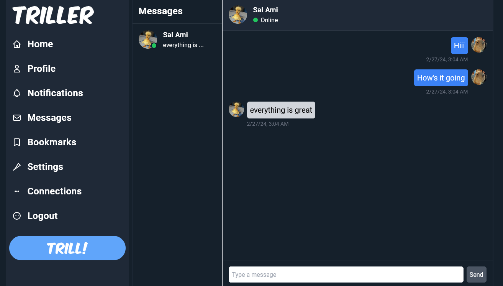

# Triller: A Microblogging Social Media Platform

Triller is a social media platform that mimics the functionality of Twitter, 
allowing users to share their thoughts, updates, and more through short posts called Trills. 
Users can engage with Trills by liking, commenting, and reposting them. Additionally, 
the platform supports user-to-user connections with a follow system. Finally, users can 
communicate with each other through a real-time messaging system

## Live Demo
https://triller.azurewebsites.net/

## Table of Contents
- [Features](#features)
- [Tech Stack](#tech-stack)
- [Architecture](#architecture)
- [Installation](#installation)
  - [Server Installation](#server-installation)
  - [Client Installation](#client-installation)
- [Usage](#usage)
- [Configuration](#configuration)
- [Screenshots](#screenshots)
- [License](#license)

## Features
- **Authorization**: Users need to sign in or register to be able to use the application.
- **Trills**: Users can compose and share short posts, known as Trills, with their followers. They can attach photos to their Trills.
- **Engagement**: Users can express their opinions by liking, commenting, and reposting Trills.
- **Follow System**: Users can follow each other to stay updated on the latest Trills from their connections.
- **Blocking System**: Users can block each other to prevent interactions and viewing of content.
- **Reply to Trills**: Users can reply to Trills to engage in conversations and discussions.
- **Repost Trills**: Users can repost Trills to share them with their own followers.
- **Bookmark Trills**: Users can bookmark Trills to save them for later viewing.
- **Share Trills**: Users can share Trills with others via external platforms or messaging.
- **Thumbs Up/Down**: Users can express their sentiment on replies with thumbs up or thumbs down reactions.
- **Language Toggle**: Users can toggle between English and Spanish languages for the website interface.
- **Messaging System**: Users can message each other privately.
- **Notification System**: Users receive notifications for activities such as likes, comments, follows, and messages.
- **Profile Editing**: Users can edit their profile information, including profile picture, bio, and other details.


## Tech Stack
### API
- **ASP.NET 8**
- **Entity Framework**

### Database
- **Microsoft SQL Server**

### Authentication
- **ASP.NET Identity**
- **JSON Web Tokens (JWT)**

### Web Client
- **Angular 17**
- **Angular Material**
- **Tailwind CSS**

### Infrastructure
- **Microsoft Azure** (for deployment)

### External Services
- **Cloudinary** (for photo uploading)

## Architecture
### Layered Architecture with Repository and Unit of Work Patterns
Triller is a monolith application that follows the layered architecture design pattern, incorporating the Repository and Unit of Work Patterns to organize and manage data access logic effectively.
- **Repository Pattern:** Data access logic is encapsulated in repositories, providing a clean separation between the data layer and the business logic. Each entity type typically has its own repository class responsible for CRUD operations.
- **Unit of Work Pattern:** The Unit of Work pattern coordinates multiple repositories and ensures that all changes to the database are made within a single transaction. This pattern helps maintain data integrity and consistency.

By adhering to these patterns, Triller achieves better maintainability, testability, and separation of concerns within its architecture.

## Installation
### Server Installation

To install and run the Triller server (ASP.NET) locally, follow these steps:

1. Clone this repository:

    ```
    git clone https://github.com/mespino4/Triller
    ```

2. Navigate to the `api-aspnet` directory:

    ```
    cd api-aspnet
    ```

3. Install dependencies:

    ```
    dotnet restore
    ```

### Client Installation

To install and run the Triller client (Angular) locally, follow these steps:

1. In a second terminal navigate to the `client-angular` directory:

    ```
    cd client-angular
    ```

2. Install dependencies:

    ```
    npm install
    ```
    
3. Run the Angular development server:

    ```
    ng serve
    ```
    
## Usage

- Access the frontend application in your browser at `http://localhost:4200`.
- Explore the different features and functionalities of the application.
- Use the provided authentication mechanism to log in and access restricted resources.

## Configuration

- Backend:
  - Database connection settings: Update the connection string in `appsettings.json`.
  - Authentication settings: Configure authentication providers, JWT tokens, etc., in `Program.cs`.

- Frontend:
  - API base URL: Update the base URL of the backend API in `environment.ts` for development and `environment.prod.ts` for production.

## Screenshots
### Home page


### Profile page


### Notifications page


### Messages page


### Bookmarks page


### Settings page


### Connections page


### Spanish Version


## License
This project is licensed under the [MIT License](LICENSE).
